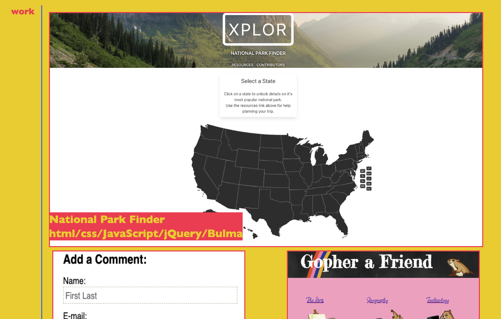
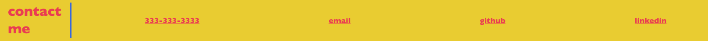

# Challenge 1

## Description

This is a responsive portfolio.
Links in nav bar take user to sections of the webpage and to my resume.
Images on site link to their respective projects for in-depth viewing.
"Contact me" section at the bottom of the page also contains functioning links.

## Installation

No installation needed.

## Usage

Click headings in nav bar or scroll to view webpage content. 

Click screenshots in "work" section to view project webpage. 

Click links in "contact me" section to email, view github profile, and view linkedin page. 

## Credits

Background image under header from freepik.com and designed by starline.

## Features

Clickable links, responsive design
